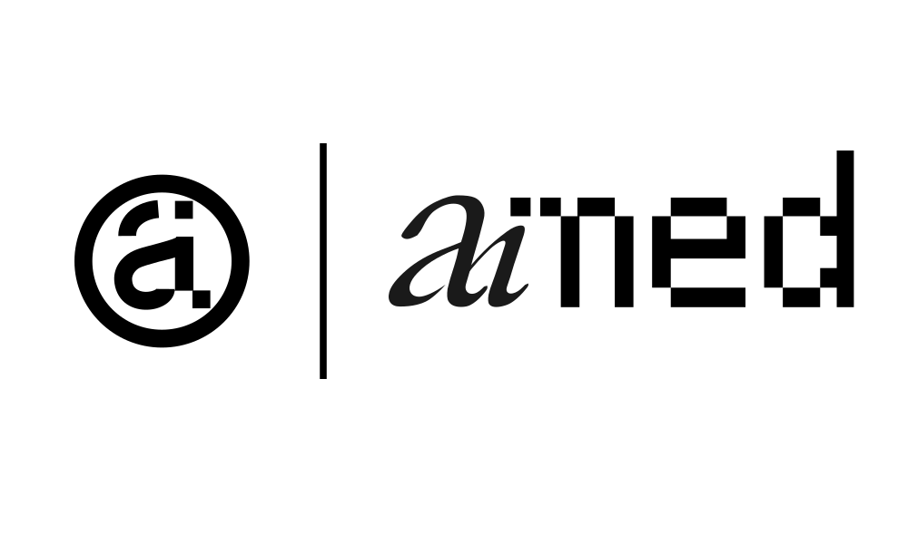

<p align="center">
  <br>
  
</p>

<p align="center"><strong>AI Involvement Marking for Every Document</strong></p>

<p align="center">
  An open standard for transparently declaring AI involvement in content and code.<br>
  <code>AIMED/1 I:2 D:4 E:3 | tool=claude-4</code>
</p>

<p align="center">
  <a href="spec/AIMED-v1.0.md">Specification</a> ·
  <a href="playground/">Playground</a> ·
  <a href="lib/">Parser</a> ·
  <a href="schema/">Schema</a> ·
  <a href="#quick-start">Quick Start</a>
</p>

---

## Why aiMed?

A single "made with AI" label doesn't cut it. A blog post where AI helped with research is fundamentally different from one AI wrote entirely. A codebase where AI generated boilerplate is different from one where AI designed the architecture.

aiMed breaks AI involvement into **specific areas** (ideation, research, drafting, editing, etc.) and scores each on a **0–5 scale**. It's granular enough to be meaningful, simple enough to actually use.

## Quick Start

### Write a declaration

```
AIMED/1 D:4 E:2 V:3 | tool=claude-4
```

This says: AI was heavily involved in **D**rafting (4/5), lightly involved in **E**diting (2/5), and moderately involved in **V**alidation (3/5), using Claude 4.

> **Note:** The declaration identifier is always uppercase `AIMED/1` for machine parsing. The display name of the standard is **aiMed**.

### Core Areas

| Code | Area | Code | Area |
|------|------|------|------|
| `I` | Ideation | `T` | Translation |
| `R` | Research | `V` | Validation |
| `D` | Drafting | `A` | Analysis |
| `E` | Editing | `G` | Visual/Design |
| `S` | Strategy | `X` | Execution |

### Intensity Scale

| Score | Label | Meaning |
|-------|-------|---------|
| 0 | None | No AI involvement |
| 1 | Minimal | Minor suggestions, mostly discarded |
| 2 | Light | AI contributed but human drove the process |
| 3 | Moderate | Roughly equal AI/human contribution |
| 4 | Heavy | AI produced most output; human guided and refined |
| 5 | Full | AI generated with minimal human modification |

### Embed Anywhere

```html
<!-- HTML meta tag -->
<meta name="aimed" content="AIMED/1 R:3 D:4 E:2">
```

```yaml
# Markdown frontmatter
---
aimed: "AIMED/1 I:1 D:3 E:2"
---
```

```python
# Source code comment
# AIMED/1 D:5 E:3 V:4 | tool=copilot
```

```
# Git commit message
feat: add auth module

AIMED/1 S:2 D:4 E:3 V:2
```

```json
// package.json, composer.json, etc.
{
  "aimed": {
    "version": "1.0",
    "scores": { "D": 4, "E": 2, "V": 3 }
  }
}
```

## Repository Structure

```
aimed/
├── spec/               # The aiMed specification
│   └── AIMED-v1.0.md
├── schema/             # JSON Schema for validation
│   └── aimed.schema.json
├── lib/                # Parser & utility library
│   └── aimed.js        # JavaScript (browser + Node.js)
├── playground/         # Interactive badge generator & parser
│   └── index.html
├── badges/             # Logo assets and badge generator
│   ├── logotype.svg         # Text-only logotype
│   ├── logotype_a.svg       # Logotype with "a" mark
│   ├── logotype_brain.svg   # Logotype with brain mark
│   ├── mark_a.svg           # Standalone "a" mark
│   ├── mark_brain.svg       # Standalone brain mark
│   └── generate-badge.js    # CLI badge generator
├── examples/           # Real-world usage examples
├── docs/               # Additional documentation
│   ├── ADOPTING.md     # Guide for organizations
│   └── EXTENSIONS.md   # Creating domain profiles
├── .github/
│   ├── ISSUE_TEMPLATE/
│   └── workflows/
├── LICENSE             # CC0 1.0 Universal (spec only)
├── CONTRIBUTING.md
└── CODE_OF_CONDUCT.md
```

## Tools

### JavaScript Parser

```javascript
const AIMED = require('./lib/aimed.js');

// Parse compact notation
const declaration = AIMED.parse('AIMED/1 I:2 D:4 E:3 | tool=claude-4');

// Validate
const { valid, errors } = AIMED.validate(declaration);

// Convert formats
AIMED.toCompact(declaration);   // "AIMED/1 D:4 E:3 I:2 | tool=claude-4"
AIMED.toJSON(declaration);      // Pretty JSON
AIMED.toYAML(declaration);      // YAML

// Extract from any content
const found = AIMED.extract(fileContents);

// Composite score
AIMED.compositeScore({ D: 4, E: 3, I: 2 }); // 60
```

### Interactive Playground

Open `playground/index.html` in a browser — set scores visually, preview badges, export in any format, and parse/validate existing declarations.

### JSON Schema Validation

Use `schema/aimed.schema.json` with any JSON Schema validator to validate structured aiMed declarations.

## Extending aiMed

aiMed supports custom areas for domain-specific needs:

```
AIMED/1 D:3 +mu:4 +ly:2 | custom.mu="Music composition" custom.ly="Lyrics"
```

Communities can publish **domain profiles** — predefined area sets for their field. See [docs/EXTENSIONS.md](docs/EXTENSIONS.md).

## Disclaimer

aiMed is a **self-reporting transparency tool**. The aiMed project, its authors, maintainers, and contributors make no guarantees about the accuracy of any aiMed declaration and accept no responsibility for false, misleading, or misreported declarations. aiMed declarations are good-faith assertions by their authors, not verified or audited statements. See [Section 17 of the specification](spec/AIMED-v1.0.md#17-disclaimer-of-accuracy) for the full disclaimer.

## License

The **specification and tooling** are released under **CC0 1.0 Universal — Public Domain Dedication**. No rights reserved.

The **aiMed name, logos, and marks** are proprietary and may only be used in conjunction with the aiMed standard to indicate compatibility or implementation. See [Section 16 of the specification](spec/AIMED-v1.0.md#16-trademark-and-logo-usage) for details.

## Contributing

Contributions are welcome. See [CONTRIBUTING.md](CONTRIBUTING.md) for guidelines.

Whether you're adding support for a new format, building a parser in another language, creating a domain profile, or improving the spec — all contributions move transparency forward.

---

<p align="center">
  <sub>This README: <code>AIMED/1 I:3 S:3 D:4 E:2 | tool=claude-opus-4</code></sub>
</p>
